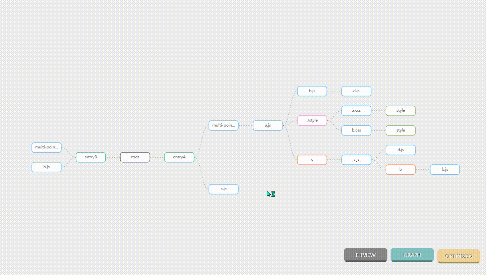
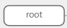
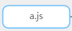
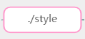
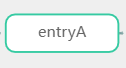
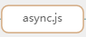

<!-- PROJECT SHIELDS -->
[![GitHub license][license-shield]][license-url]
<!-- PROJECT LOGO -->

<br />

<p align="center">
  <a href="https://github.com/srhinee/block-analysis-webpack-plugin.git">
    
  </a>

<h3 align="center">webpack module dependency analysis </h3>
  <p align="center">
    Rendering webpack module dependencies based on the G6 graph visualization engine
    <br />
    <br />
    <a href="./readme.zh.md">中文</a>
    ·
    <a href="">report bugs</a>
    ·
    <a href="">propose new features</a>
  </p>
</p>

## Contents

- [Demo](#Demo)
- [Get Started](#Get Started)
- [Introduction](#Introduction)
- [Concepts](#Concepts)
- [Examples](#Examples)
- [License](#License)
- [Thanks](#Thanks)

## Demo



## Get Started

### Install

```shell
# NPM
npm install --save-dev block-analysis-webpack-plugin
# Yarn
yarn add -D block-analysis-webpack-plugin
```

### Usage

```js
const blockAnalyzerPlugin = require ('block-analysis-webpack-plugin');

// webpack.config
module.exports = {
  plugins: [
    new blockAnalyzerPlugin ()
  ]
}
```

## Introduction

This plugin can help you view the module dependencies in your project, analyze how the code of each file in your project is organized in webpack, the plugin collects the structure of the webpack module and uses the G6 visualization engine to render it, the plugin mode origin and optimize represent It shows the module structure of webpack before and after optimizing the chunk, and has two layouts: tree and graph. Click on each node to view the details of the module, including module type, resource path, module dependencies, and the chunk it belongs to.

It should be noted that chunk optimization is a series of behaviors performed in the seal phase of webpack. In the seal phase, there will be a series of hook functions such as optimize Dependencies, optimize Modules, and optimize Chunks to optimize the final output code.
**The node rendered in origin mode is the data structure that occurred before the seal stage, which can be understood as the original organizational structure of the project code. The node in optimize mode is the data structure when webpack is about to generate a bundle, which can be understood as when the project is packaged. organizational structure.**

## Concepts
### NodeType

- **rootNode**
  , the starting node of the layout, only used for layout needs, meaningless.

- **chunkNode**
 ,The optimize mode is unique, and there are as many chunk nodes as there are chunks generated by webpack.

- **NormalModule**,
  The type generated by the synchronous import file is the most common and the only real node in the project. Each NormaModule represents a real project file. ES6 imports `import mod from '.a.js'` or `const mod=require('. a.js')` statement will generate a node named a.js

- **ConcatenatedModule**,When `optimization.concatenateModules` is enabled, this type of module will be generated. It will be enabled by default in webpack production mode, which is the so-called scope hoisting. At this time, multiple normalModule will be merged into one concatenateModule according to the merge rules. For details, see [optimization](https://webpack.docschina.org/configuration/optimization/#optimizationconcatenatemodules)

- **ContextModule**
  ,Context module, which contains references to all modules in the directory. If a request matches a regular expression, it can be required. The `require.context('.style',false,.css)` statement will generate a context module, or Is an import expression statement, such as `import(name+'.css')`, see [Dependency Management](https://webpack.docschina.org/guides/dependency-management/#require-with-expression)

- **MultiModule**节点,
  When the value of the webpack entry is a list type, such modules will be generated, and multiple abstract modules of normalModule will be generated.
  ```js
  //webpack.config
  entry: {
    entryA: [path.resolve (__dirname, "index.js"), path.resolve (__dirname, "a.js")]
    entryB:[path.resolve (__dirname, "index.js"), path.resolve (__dirname, "b.js")]
  }
  ```

- **CssModule**
  节点,Nodes generated during css extraction, generated by `Mini Css Extract Plugin`, are represented as an extracted css file.


- **
  ImportDependenciesBlock**节点,The type generated when ES 6 is dynamically imported, the `import('.c').then()` statement will generate a node named c

- **
  AMDRequireDependenciesBlock**节点,AMD imports the generated type, the `require (['.amd.js'],(module)=>{})` statement will generate a node named amd.js

- **
  RequireEnsureDependenciesBlock**节点,The webpack-specific CJS asynchronously imports the generated type. The `require.ensure([".shared"], (shared)=> {})` statement will generate a node named shared. For details, see [module-methods](https://webpack.js.org/api/module-methods/)

- **
  AsyncDependenciesBlock**节点, The type that will be generated by the dynamic loading expression, usually a child node of the context Module
  ```js
  //index.js
  function dynamicImport(name) {
    return import (`./lib/'+ ${name} + '.js`)
  }
  dynamicImport('async')
  ```
 At this point, webpack will create a context Module based on the import expression to match all `.js` files in the `lib` folder, and then create a node of this type based on the matched `async.js`.

### Mode

#### OriginMode

The data is collected during the `compilation.hooks.seal` period. At this time, webpack only has the original module structure, does not optimize the module graph, and does not have the concept of chunk. In this mode, the chunk to which the module belongs cannot be seen.
#### OptimizeMode

The data is collected during the `compilation.hooks.beforeModuleAssets` period. At this time, a series of optimizations of webpack have been completed. Only assets are created for outputting bundles. The data at this stage is counted according to the chunk. Through this stage and the origin stage The comparison shows the changes to the module structure during webpack optimization.

### Layout

#### TreeLayout


The advantage of the tree layout is that it can well express the hierarchical structure between modules. Compared with the graph layout, the structure is clearer, but the disadvantage is that it cannot express the many-to-many relationship between modules and the ring structure. Therefore, the hover state is used to increase the Highlight the same node under different parent nodes, all equally highlighted nodes can be regarded as equivalent nodes. Suppose there are the following files:
```js
//a.js
import b from 'b.js'
import c from 'c.js'
//b.js
import c from 'c.js'
//c.js
import d from 'd.js'
//d.js
export default d
```

Node data collection uses dfs traversal, so in the above example it will be the following structure:

Nodes of the same depth will only be rendered once, so it won't be like this:


#### GraphicalLayout

The advantage of the graph layout is that it can express the ring structure, but the performance is poor when there are too many nodes. The hover state of the graph layout is to highlight the connected nodes.


## Examples

todo...

## License

The project is signed under the MIT license,
see [LICENSE.txt](https://github.com/shaojintian/Best_README_template/blob/master/LICENSE.txt)

## Thanks

- [G6](https://g6.antv.vision/zh)
- [Webpack](https://webpack.js.org/)
- [Img Shields](https://shields.io)

<!-- links -->

[license-shield]: https://img.shields.io/github/license/srhinee/block-analysis-webpack-plugin?style=flat-square

[license-url]: https://github.com/srhinee/block-analysis-webpack-plugin/blob/main/LICENSE


