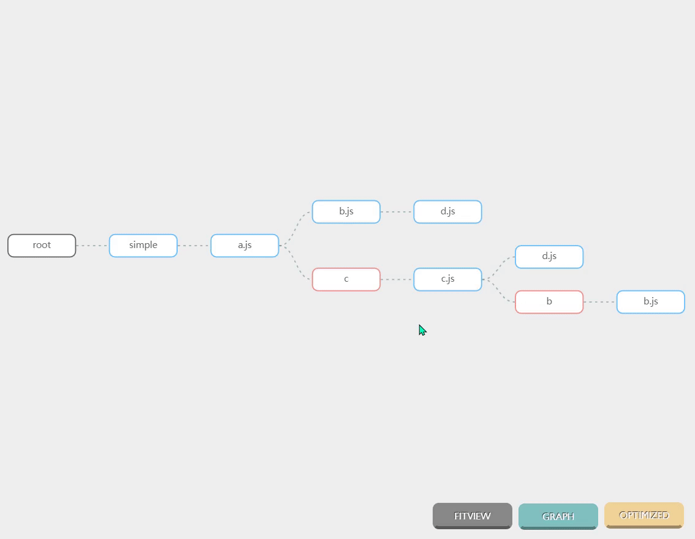

<!-- PROJECT SHIELDS -->
[![GitHub license][license-shield]][license-url]
<!-- PROJECT LOGO -->

<br />

<p align="center">
  <a href="https://github.com/srhinee/block-analysis-webpack-plugin.git">
    
  </a>

<h3 align="center">webpack module dependency analysis </h3>
  <p align="center">
    Rendering webpack module dependencies based on the G6 graph visualization engine
    <br />
    <br />
    <a href="">中文</a>
    ·
    <a href="">report bugs</a>
    ·
    <a href="">propose new features</a>
  </p>
</p>

## Contents

- [Demo](#Demo)
- [Get Started](#Get Started)
- [Introduction](#Introduction)
- [Concepts](#Concepts)
- [Examples](#Examples)
- [License](#License)
- [Thanks](#Thanks)

## Demo



## Get Started

### Install

```shell
# NPM
npm install --save-dev block-analysis-webpack-plugin
# Yarn
yarn add -D block-analysis-webpack-plugin
```

### Usage

```js
const blockAnalyzerPlugin = require ('block-analysis-webpack-plugin');

// webpack.config
module.exports = {
  plugins: [
    new blockAnalyzerPlugin ()
  ]
}
```

## Introduction

此插件可以帮助你查看项目中的模块依赖,分析你项目中各个文件代码是如何在webpack中组织的,插件对webpack
module的结构进行收集并使用G6可视化引擎进行渲染,插件的模式origin和optimize代表了webpack在对chunk进行优化前后的模块结构,并且具有tree和graph两种布局,
点击每一个节点可以查看module的详情,包括module的类型,资源路径,模块依赖,所属的chunk等.

需要说明的是,chunk优化就是webpack的seal阶段进行的一系列行为,seal阶段会有optimizeDependencies,optimizeModules,optimizeChunks等一系列钩子函数来进行最终输出代码的优化,
**origin模式下被渲染的节点是发生在seal阶段之前的数据结构,可以理解为项目代码原始的组织结构,optimize模式下的节点是在webpack即将生成bundle时候的数据结构,可以理解为项目打包时的组织结构.**

## Concepts

### 节点的类型

- **AsyncDependenciesBlock**
  ES6按需加载生成的类型,`() => import('./async.js')`语句会生成名为async.js的节点
- **ImportDependenciesBlock**
  ES6动态导入时生成的类型,`import('./c').then()`语句会生成名为c的节点


- **
  AMDRequireDependenciesBlock**  待定 生成的类型,`(resolve) => require (['./amd.js'], resolve)`语句会生成名为amd.js的节点
- **
  RequireEnsureDependenciesBlock** 待定 生成的类型 `require.ensure(["./shared"], (shared)=> {}`语句会生成名为shared的节点
- **NormalModule**
  ES6普通导入文件产生的类型,项目中最为普遍,`import mod from './a.js'`
  语句会生成名为a.js的节点
- **
  ConcatenatedModule** `optimization.concatenateModules`
  开启时会产生该类型模块,webpack production mode下会默认开启,也就是所谓的作用域提升(scope hoisting)
  ,这时多个normalModule会根据合并规则合并在一个concatenateModule,详情见[优化](https://webpack.docschina.org/configuration/optimization/#optimizationconcatenatemodules)
- **ContextModule** 上下文模块,它包含
  目录下的所有模块 的引用，如果一个 request 符合正则表达式，就能 require 进来,`require.context('./style',false,/.css$/)`
  语句会生成一个context模块,一般用于批量导入一些资源什么的.详情见 [依赖管理](https://webpack.docschina.org/guides/dependency-management/#require-with-expression)
- **MultiModule** 当entry的值为list类型会生成此类模块,多个normalModule的抽象模块

```js
//webpack.config
entry: {
  entryA: [path.resolve (__dirname, "index.js"), path.resolve (__dirname, "a.js")]
  entryB:[path.resolve (__dirname, "index.js"), path.resolve (__dirname, "b.js")]
}
```

- **CssModule**

### 渲染模式

#### 树状结构

#### 图状结构

## Examples

## License

The project is signed under the MIT license,
see [LICENSE.txt](https://github.com/shaojintian/Best_README_template/blob/master/LICENSE.txt)

## Thanks

- [G6](https://g6.antv.vision/zh)
- [Webpack](https://webpack.js.org/)
- [Img Shields](https://shields.io)

<!-- links -->

[license-shield]: https://img.shields.io/github/license/srhinee/block-analysis-webpack-plugin?style=flat-square

[license-url]: https://github.com/srhinee/block-analysis-webpack-plugin/blob/main/LICENSE


