<!-- PROJECT SHIELDS -->
[![GitHub license][license-shield]][license-url]
![workflow][workflow-shield]
![version][version-shield]
<!-- PROJECT LOGO -->

<br />

<p align="center">
  <a href="https://github.com/srhinee/block-analysis-webpack-plugin.git">
    
  </a>

<h3 align="center">webpack模块依赖分析 </h3>
  <p align="center">
    基于 G6 图形可视化引擎渲染 webpack 模块依赖
    <br />
    <br />
    <a href="./readme.md">English</a>
    ·
    <a href="">报告错误</a>
    ·
    <a href="">提出新功能</a>
  </p>
</p>

## 目录

- [演示](#演示)
- [开始使用](#开始使用)
- [介绍](#介绍)
- [概念](#概念)
- [例子](#例子)
- [许可](#许可)
- [致谢](#致谢)

## 演示

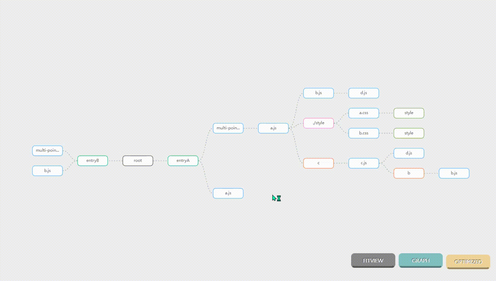

## 开始使用

### 安装

```shell
# NPM
npm install --save-dev block-analysis-webpack-plugin
# Yarn
yarn add -D block-analysis-webpack-plugin
```

### 用法

```js
const blockAnalyzerPlugin = require ('block-analysis-webpack-plugin');

// webpack.config
module.exports = {
  plugins: [
    new blockAnalyzerPlugin ()
  ]
}
```

## 介绍

此插件可以帮助你查看项目中的模块依赖,分析你项目中各个文件代码是如何在webpack中组织的,插件对webpack
module的结构进行收集并使用G6可视化引擎进行渲染,插件的模式origin和optimize代表了webpack在对chunk进行优化前后的模块结构,并且具有tree和graph两种布局,
点击每一个节点可以查看module的详情,包括module的类型,资源路径,模块依赖,所属的chunk等.

需要说明的是,chunk优化就是webpack的seal阶段进行的一系列行为,seal阶段会有optimizeDependencies,optimizeModules,optimizeChunks等一系列钩子函数来进行最终输出代码的优化,
**origin模式下被渲染的节点是发生在seal阶段之前的数据结构,可以理解为项目代码原始的组织结构,optimize模式下的节点是在webpack即将生成bundle时候的数据结构,可以理解为项目打包时的组织结构.**

## 概念

### 节点的类型

- 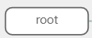**root节点**
  ,布局的起始节点,仅用于布局需要,无含义.

- 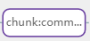**chunk节点**
  optimize模式特有,webpack生成多少chunk就会有多少chunk节点

- 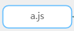**NormalModule**节点,
  同步导入文件产生的类型,项目中最为普遍,也是惟一的真实节点,每一个NormaModule均代表一个真实项目文件,ES6导入`import mod from './a.js'`或者`const mod=require('./a.js')`
  语句会生成名为a.js的节点

- 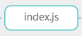**ConcatenatedModule**节点,`optimization.concatenateModules`开启时会产生该类型模块,webpack production mode下会默认开启,也就是所谓的作用域提升(scope hoisting)
  ,这时多个normalModule会根据合并规则合并在一个concatenateModule,详情见[优化](https://webpack.docschina.org/configuration/optimization/#optimizationconcatenatemodules)

- 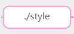**ContextModule**
  节点,上下文模块,它包含目录下的所有模块的引用，如果一个 request 符合正则表达式，就能 require 进来,`require.context('./style',false,/.css$/)`
  语句会生成一个context模块,或者是一个导入表达式语句,如`import(name+'.css')`
  ,详情见 [依赖管理](https://webpack.docschina.org/guides/dependency-management/#require-with-expression)

- 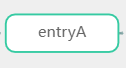**MultiModule**节点,
  当webpack entry的值为list类型会生成此类模块,多个normalModule的抽象模块
  ```js
  //webpack.config
  entry: {
    entryA: [path.resolve (__dirname, "index.js"), path.resolve (__dirname, "a.js")]
    entryB:[path.resolve (__dirname, "index.js"), path.resolve (__dirname, "b.js")]
  }
  ```

- **CssModule**
  节点,css提取时生成的节点,由`MiniCssExtractPlugin`产生,表示为一个被提取的css文件.


- 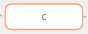**ImportDependenciesBlock**节点, ES6动态导入时生成的类型,`import('./c').then()`语句会生成名为c的节点

- 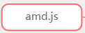**AMDRequireDependenciesBlock**节点,AMD导入生成的类型,`require (['./amd.js'],(module)=>{})`语句会生成名为amd.js的节点

- 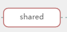**RequireEnsureDependenciesBlock**节点,webpack特有的CJS异步导入生成的类型,`require.ensure(["./shared"], (shared)=> {})`
  语句会生成名为shared的节点,详情可见[module-methods](https://webpack.js.org/api/module-methods/)

- 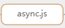**AsyncDependenciesBlock**节点, 动态加载表达式会生成的类型,一般是contextModule的子节点
  ```js
  //index.js
  function dynamicImport(name) {
    return import (`./lib/'+ ${name} + '.js`)
  }
  dynamicImport('async')
  ```
  此时webpack会根据导入表达式创建contextModule来匹配所有在`lib`文件夹下的所有`.js`文件,之后根据匹配到的`async.js`创建一个该类型节点.

### 模式

#### origin模式

数据收集在`compilation.hooks.seal`时期,此时webpack只有原始的module结构,没有对module graph进行优化,同时也没有chunk的概念,该模式下也无法看到module所属的chunk.

#### optimize模式

数据收集在`compilation.hooks.beforeModuleAssets`
时期,此时webpack的一系列优化均已完成只剩下创建assets用于输出bundle,该阶段的数据是根据chunk来进行统计,通过该阶段和origin阶段的对比可以了解到webpack优化期间对module结构的变更.

### 布局

#### 树状布局

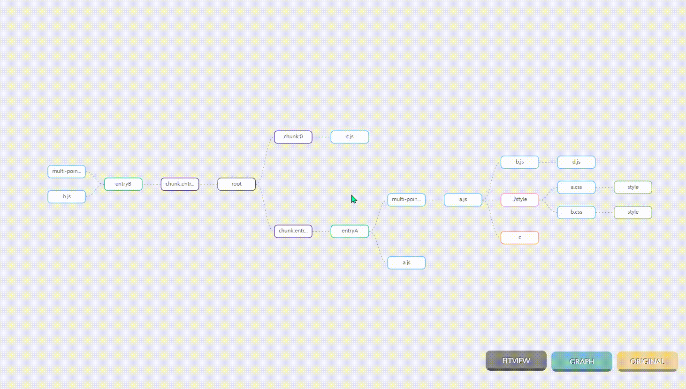
树布局的优点是能很好表达module之间的层级结构,相比图布局来说结构更加清晰,但缺点是不能表达模块间多对多关系,以及环状结构.所以使用了hover状态来高亮提示不同父节点下相同的节点,凡是同等高亮的节点均可看做等价节点. 假设有以下文件:

```js
//a.js
import b from 'b.js'
import c from 'c.js'
//b.js
import c from 'c.js'
//c.js
import d from 'd.js'
//d.js
export default d
```

节点数据采集使用dfs遍历,故在上面的例子中会是以下结构:

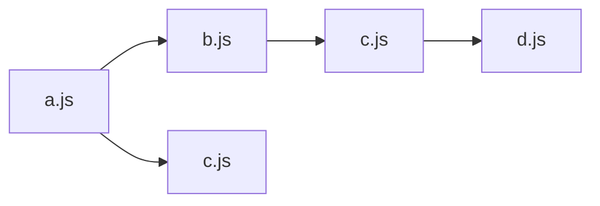
相同深度的节点只会渲染一次,所以不会是这样:
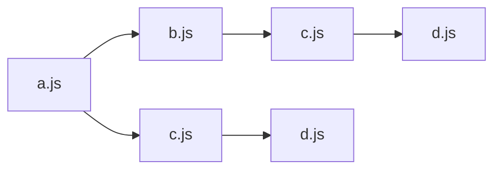
#### 图状布局
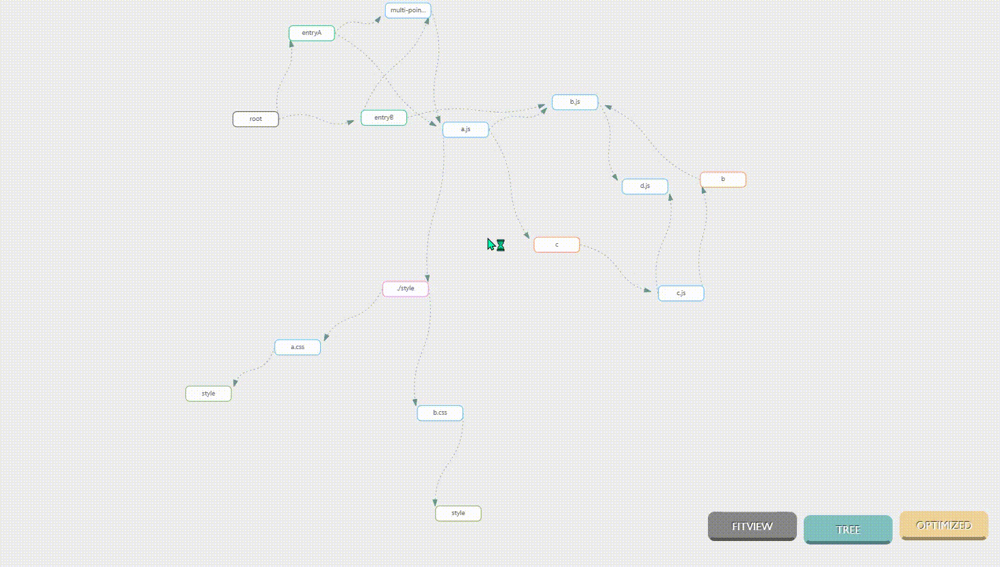
图状布局的优势是能表达环状结构,但是在节点过多时表现很差,图布局的hover状态是高亮显示相连节点.

## 例子

todo...

## 许可

该项目是在 MIT 许可下签署,见 [LICENSE.txt](https://github.com/shaojintian/Best_README_template/blob/master/LICENSE.txt)

## 致谢

- [G6](https://g6.antv.vision/zh)
- [Webpack](https://webpack.js.org/)
- [Img Shields](https://shields.io)

<!-- links -->

[license-shield]: https://img.shields.io/github/license/srhinee/block-analysis-webpack-plugin?style=flat-square

[license-url]: https://github.com/srhinee/block-analysis-webpack-plugin/blob/main/LICENSE

[workflow-shield]:https://img.shields.io/github/workflow/status/srhinee/block-analysis-webpack-plugin/npm%20public?style=flat-square 

[npm-shield]:https://img.shields.io/npm/dw/block-analysis-webpack-plugin?style=flat-square

[version-shield]:https://img.shields.io/npm/v/block-analysis-webpack-plugin?style=flat-square

